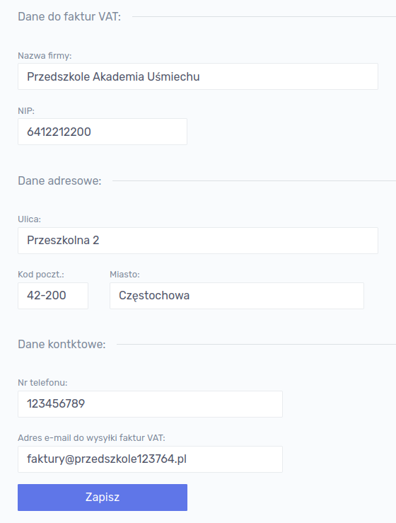
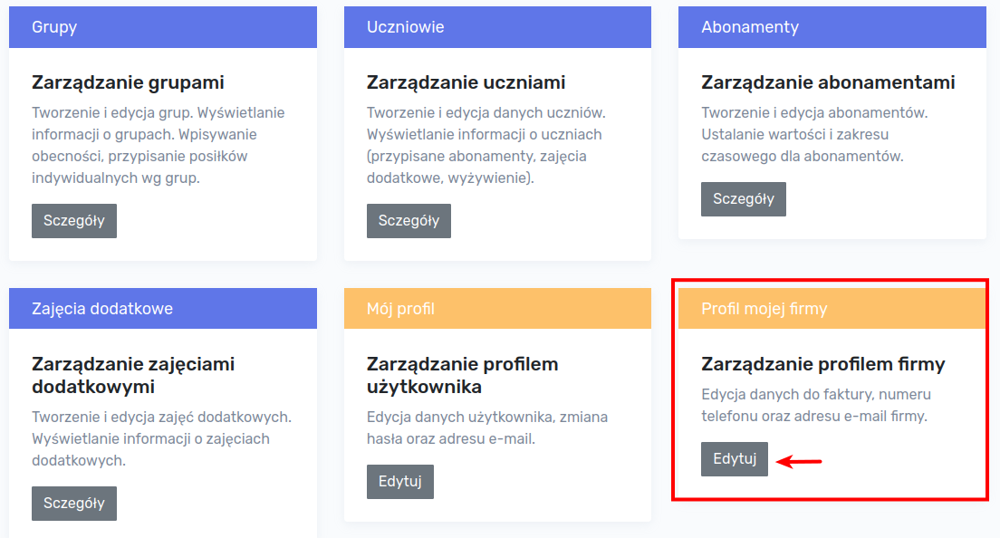
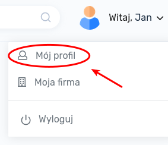
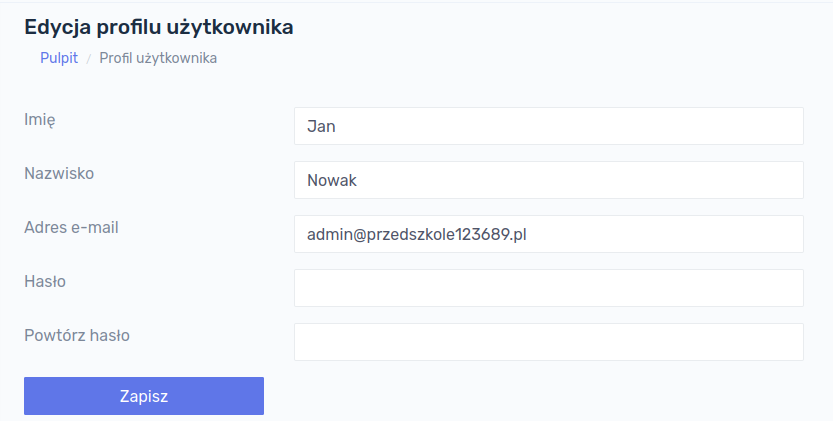
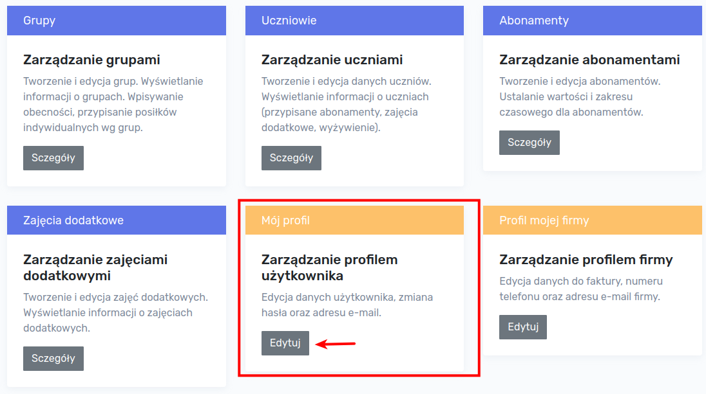

# Pierwsze kroki

## Profil firmy

Po poprawnym zalogowaniu się do aplikacji należy uzupełnić profil firmy. Można tego dokonać klikając w prawym górnym rogu na nazwie użytkownika i wybierając pozycję `Moja firma`.

!> UWAGA! Jeśli aplikacja wykryje, że profil firmy nie jest uzupełniony wyświetli na głównym pulpicie stosowny komunikat. Informacja zawiera link, do strony na której możemy uzupełnić profil firmy:

Po przejściu do strony zawierającej informacje na temat firmy należy je uzupełnić. Na podane w formularzu dane zostanie wystawiona faktura VAT. Należy uzupełnić **wszystkie** pola, tj:

- nazwa firmy
- NIP
- ulica
- kod pocztowy
- miasto
- nr telefonu do osoby kontaktowej
- adres e-mail do wysyłki faktur VAT

Dane zapisujemy klikając przycisk `Zapisz`. 

Do formularza edycji danych firmy można również przejść bezpośrednio z głównego pulpitu aplikacji:

## Profil użytkownika

W celu uzupełnienia profilu użytkownika należy kliknąć na nazwę użytkownika znajdującą się w prawym górnym rogu i wybrać opcję `Mój profil`

Formularz z danymi użytkownika zawiera dane:

- imię
- nazwisko
- adres e-mail
- hasło
- powtórzenie hasła

W tym miejscu można dokonać zmiany powyższych danych.

!> UWAGA! W przypadku gdy zapamiętujemy hasła do aplikacji w przeglądarce, pole `Hasło` może być wypełnione.  Jeśli nie chcemy zmieniać hasła, to oba pola dotyczące hasła muszą pozostać puste!

Do formularza edycji danych użytkownika można również przejść bezpośrednio z głównego pulpitu aplikacji:

