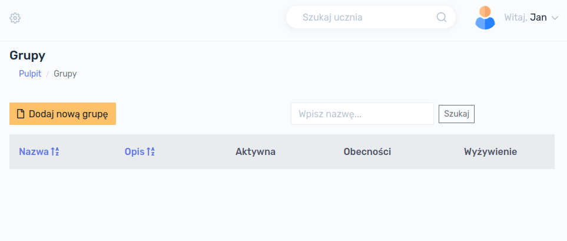
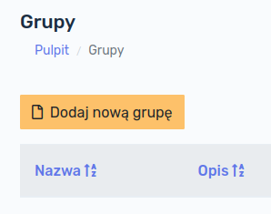
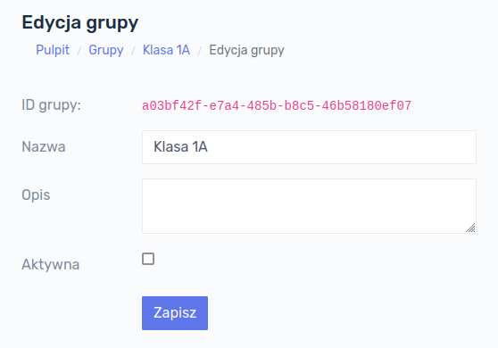
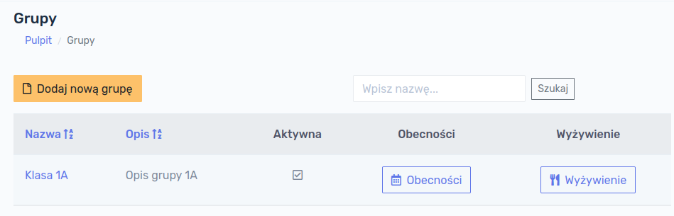
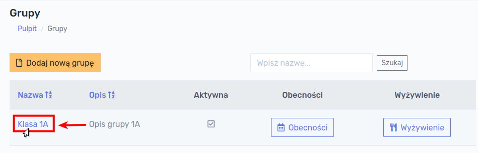
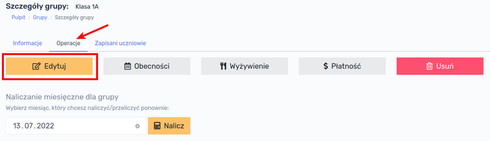
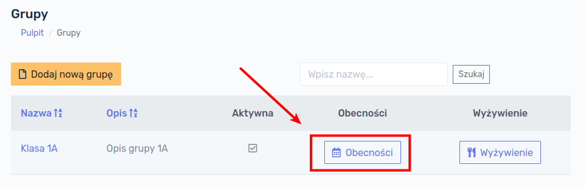
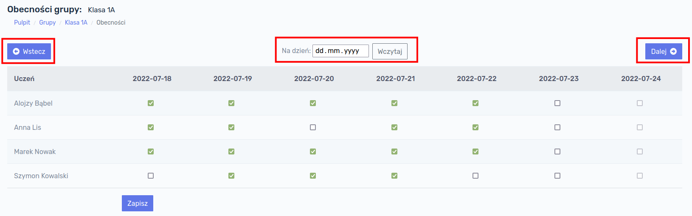

# Grupy

Pracę z programem można rozpocząć od stworzenia grup. Grupy służą uporządkowaniu uczniów i są w pewnym sensie odpowiednikiem klas w szkole. Aby wyświetlić listę grup należy w głównym menu po lewej stronie ekranu kliknąć przycisk  `Grupy`.

Po kliknięciu przycisku `Grupy` wyświetli się ekran z istniejącymi grupami.

!> W przypadku rozpoczęcia pracy z programem baza danych jest pusta i żadne grupy nie wyświetlają się na tym ekranie.

## Dodawanie grupy

W celu dodania nowej grupy należy kliknąć w przycisk `Dodaj nową grupę`:

Formularz, który się wyświetli zawiera następujące pola:

- **Nazwa grupy** - pole **<u>wymagane</u>**
- **Opis grupy** - pole **<u>opcjonalne</u>**
- **Aktywna** - określa, czy grupa jest aktywna (opis poniżej), pole **<u>opcjonalne</u>**

> **Aktywność** grupy oznacza wyświetlanie się jej na listach w innych modułach programu. Do grupy która nie jest aktywna nie można przypisać ucznia.

Po wypełnieniu formularza, klikamy przycisk `Zapisz`, następuje zapisanie informacji o grupie do bazy danych. Po ponownym Kliknięciu w przycisk `Grupy` w głównym menu, nowo dodana grupa będzie widoczna:

## Szczegóły grupy

W celu wyświetlenia szczegółów grupy należy kliknąć w nazwę konkretnej grupy na liście grup.

Wyświetli nam się informacja o grupie, tj. jej nazwa, opis oraz status (aktywna czy nie). 

## Edycja grupy

W celu dokonania edycji danych grupy, np. zmiany jej nazwy, opisu lub statusu aktywności, należy przejść do zakładki `Operacje`, a następnie kliknąć przycisk `Edytuj`:

Otworzy nam się formularz edycji grupy, analogiczny jak w przypadku Dodawania grupy. Po wprowadzeniu ewentualnych zmian można je zapisać klikając przycisk `Zapisz`.

## Usuwanie grupy

W celu usunięcia grupy należy przejść do zakładki `Operacje`, a następnie kliknąć przycisk `Usuń`.

!> **UWAGA!!! Usunięcie grupy jest operacją nieodwracalną!** Grupy nie można usunąć jeśli są do niej przypisani uczniowie.

## Obecności

Dla każdej grupy możemy prowadzić ewidencję obecności. W tym celu należy przejść na listę grup i kliknąć przycisk `Obecności` przy interesującej nas grupie.

Wyświetli się kalendarz z listą uczniów i polami do zaznaczenie obecności. Po zaznaczeniu lub odznaczeniu konkretnego pola klikamy przycisk `Zapisz`. Po kalendarzu poruszamy się korzystając z przycisków `Wstecz` oraz `Dalej`. W celu szybkiego przejścia do innego miesiąca lub roku korzystamy z pola kalendarza na środku ekranu.

