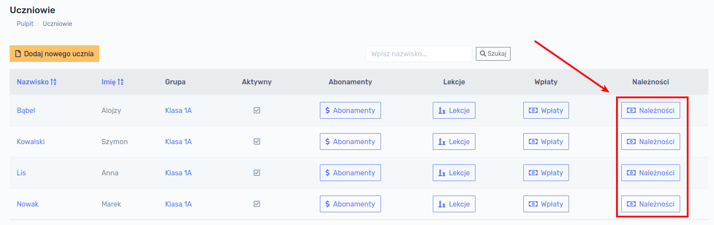

# Uczniowie

Kolejnym etapem pracy z programem jest dodanie uczniów. Aby wyświetlić listę grup należy w głównym menu po lewej stronie ekranu kliknąć przycisk  `Uczniowie`.

Po kliknięciu przycisku `Uczniowie` wyświetli się ekran z istniejącymi w bazie danych uczniami.

!> W przypadku rozpoczęcia pracy z programem baza danych jest pusta i nie wyświetli żadnego ucznia.

## Dodawanie ucznia

W celu dodania do bazy danych nowego ucznia należy kliknąć w przycisk `Dodaj nowego ucznia`:

Formularz, który się wyświetli zawiera poniższe pola.

Pola wymagane:

- **Nazwisko**
- **Imię** 

Pola opcjonalne:

- Ulica
- Kod pocztowy
- Miejscowość
- Adres zamieszkania
- Data urodzenia
- PESEL
- Telefon
- Dodatkowy telefon
- Uwagi
- Adres e-mail
- Grupa
- Checkbox *Aktywny*

> **Aktywność** ucznia oznacza, że uczeń będzie wyświetlał się na różnych listach w innych modułach programu. Odznaczenie tego pola oznacza, że nie można mu przypisać np. żadnego abonamentu, zajęć dodatkowych itd.

> **Grupa** może być przypisana uczniowi lecz nie jest to konieczne. Dowolność tej opcji służy temu, aby można było wcześniej przygotować kartoteki uczniów np. przed rozpoczęciem zajęć lub roku szkolnego.

W celu dodania ucznia do bazy danych należy kliknąć przycisk `Zapisz`.

Po ponownym Kliknięciu przycisku `Uczniowie` w głównym menu, nowo dodany uczeń będzie widoczny na liście uczniów

## Szczegóły ucznia

W celu wyświetlenia szczegółów ucznia, należy kliknąć w jego nazwisko na liście uczniów.

Po kliknięciu w nazwisko wyświetli się ekran ze szczegółami ucznia:

## Edycja ucznia

W celu dokonania edycji danych ucznia, np. zmiany adresu, grupy lub statusu aktywności, należy wyświetlić szczegóły ucznia, a następnie przejść do zakładki `Operacje` oraz kliknąć przycisk `Edytuj`:

Otworzy nam się formularz edycji danych ucznia, analogiczny jak w przypadku dodawania nowego ucznia. Po wprowadzeniu ewentualnych zmian można je zapisać klikając przycisk `Zapisz`.

## Usuwanie ucznia

W celu usunięcia ucznia należy przejść do zakładki `Operacje`, a następnie kliknąć przycisk `Usuń`.

!> **UWAGA!!! Usunięcie ucznia jest operacją nieodwracalną!** Ucznia nie można usunąć jeśli dokonano jakiegokolwiek naliczenia (np. wcześniej naliczono jakiś abonament, wyżywienie lub zajęcia dodatkowe).

## Należności ucznia

W celu sprawdzenia stanu należności ucznia należy kliknąć w głównym menu przycisk `Uczniowie`, a następnie `Należności`:

Wyświetli nam się stan należności ucznia:

Okno zawiera wpisy dokonane w bieżącym miesiącu. W celu sprawdzenia innego miesiąca należy wybrać dowolną datę z kalendarza i kliknąć przycisk `Wczytaj`. 

!> UWAGA! Wybranie konkretnego dnia nie ma znaczenia w tym raporcie. Np. wybierając 2-go maja 2022 wczytamy wszystkie wpisy z maja 2022.

W celu sprawdzenia wpisów z całego roku, należy kliknąć przycisk `Zestawienie roczne`, otworzy się okno zawierające podsumowanie z całego roku:

W celu szybkiego przejścia do danego miesiąca, klikamy przycisk `Szczegóły` przy interesującym nas miesiącu.