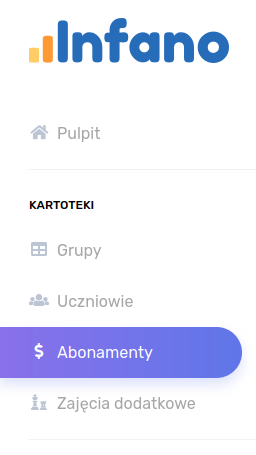
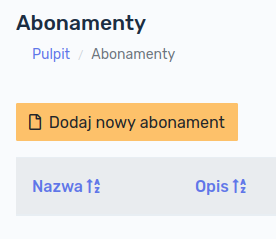
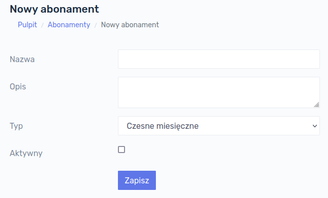
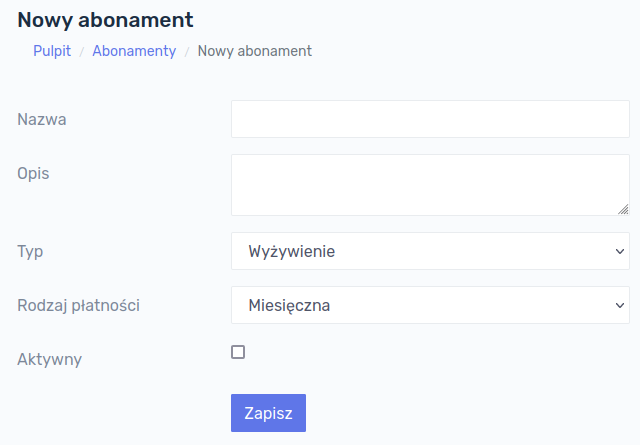
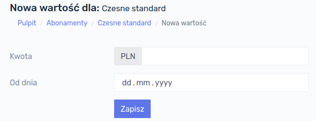
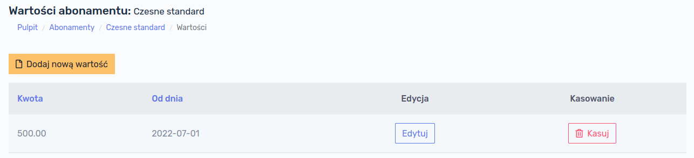
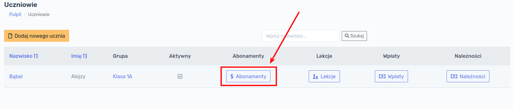

# Abonamenty

Aby program mógł poprawnie dokonywać naliczeń należy skonfigurować odpowiednio abonamenty. W celu wyświetlenia listy abonamentów, należy kliknąć, w głównym menu po lewej stronie ekranu, przycisk `Abonamenty`:

Po kliknięciu przycisku `Abonamenty` wyświetli się ekran z istniejącymi w bazie danych abonamentami.

!> W przypadku rozpoczęcia pracy z programem baza danych jest pusta i nie wyświetli żadnego abonamentu.

## Dodawanie abonamentu

W celu dodania do bazy danych nowego abonamentu należy kliknąć w przycisk `Dodaj nowy abonament`:

Formularz, który się wyświetli zawiera poniższe pola.

Pola wymagane:

- **Nazwa**
- **Typ** 

Pola opcjonalne:

- Opis
- Checkbox *Aktywny*

> **Aktywność** abonamentu oznacza, że abonament będzie wyświetlał się na różnych listach w innych modułach programu. Odznaczenie tego pola oznacza, że nie będzie można przypisać tego abonamentu żadnemu uczniowi.

Po wypełnieniu formularza i kliknięciu przycisku `Zapisz`, abonament zostaje dodany do bazy danych.

## Typy abonamentów

Wyróżniamy następujące typy abonamentów:

- **Czesne miesięczne** - jest to standardowe czesne o stałej kwocie naliczane raz w miesiącu
- **Wyżywienie** - jest to abonament umożliwiający naliczanie opłat związanych z wyżywieniem. Może on być naliczany na dwa sposoby w zależności od wybranego rodzaju płatności:
  - **miesięcznie** - zostanie naliczona stała kwota jeden raz w miesiącu
  - **za obecność** - zostanie naliczona stawka dzienna za dni, w których uczeń był obecny i korzystał z wyżywienia.
- **Zajęcia dodatkowe** -  jest to abonament umożliwiający naliczanie opłat związanych z zajęciami dodatkowymi. Podobnie jak w przypadku wyżywienia, może on być naliczany na dwa sposoby w zależności od wybranego rodzaju płatności:
  - **miesięcznie** - zostanie naliczona stała kwota jeden raz w miesiącu
  - **za obecność** - zostanie naliczona stawka dzienna za dni, w których uczeń był obecny i korzystał z wyżywienia.

Nic nie stoi na przeszkodzie tworzenia wielu różnych abonamentów i konfigurowania ich w dowolny sposób.

> **Przykład:** Uczeń może mieć przypisane abonamenty:
>
> - stałe czesne miesięczne nie związane z żadnymi obecnościami w kwocie 600 zł,
> - wyżywienie 20 zł za dzień obecności
> - dodatkowe zajęcia z j. angielskiego w stałej kwocie miesięcznej 200 zł
> - dodatkowe zajęcia z robotyki w kwocie 40 zł za obecność

!> UWAGA! Standardowe pole formularza dodawania abonamentów, nie zawiera pola `Rodzaj płatności` - to pole pojawia się dopiero po wybraniu w polu `Typ` pozycji `Wyżywienie` lub `Zajęcia dodatkowe`.

## Edycja abonamentu

W celu edycji abonamentu, należy wybrać kolejno `Abonamenty` z menu głównego, a następnie kliknąć przycisk `Edytuj`:

Otworzy się formularz analogiczny jak w przypadku dodawania nowego abonamentu. Po naniesieniu zmian, należy kliknąć w przycisk `Zapisz`.

## Wartości abonamentu

Aby poprawnie naliczyć uczniowi abonament, **każdy abonament musi mieć przypisaną wartość**. W celu sprawdzenia jakie wartości są przypisane do abonamentu należy na liście abonamentów kliknąć przycisk `Sprawdź` w kolumnie `Wartości`:

Przy rozpoczęciu pracy z programem lista będzie pusta. Aby dodać nową wartość abonamentu klikamy przycisk `Dodaj nową wartość`:

Wyświetli się formularz dodania wartości abonamentu, który zawiera dwa pola:

- **Kwota** - wyrażona w zł
- **Od dnia** - data od której dana wartość obowiązuje

Po wprowadzeniu kwoty oraz daty, od której abonament obowiązuje, klikamy przycisk `Zapisz`. Aby sprawdzić wartości abonamentu należy kliknąć kolejno `Abonamenty` (w menu głównym) → `Sprawdź` w kolumnie Wartości przy odpowiednim abonamencie. Na ekranie wyświetlone zostaną wartości danego abonamentu:

W tym miejscu możemy dodać nową wartość (np. podnosimy wysokość czesnego z 500 zł na 600 zł od 1-go września) lub dokonać edycji istniejącej wartości. W celu edycji istniejącej wartości klikamy przycisk `Edytuj` przy interesującej nas pozycji. Po kliknięciu przycisku `Edytuj` wyświetli się analogiczne okno jak przy tworzeniu nowej wartości.

Rozwiązanie to pozwala na zmianę wartości abonamentu w dowolnym momencie.

>  **Przykład:** Mamy abonament "Czesne podstawowe" z przypisaną wartością 500 zł od 1-go stycznia 2022. Chcemy zwiększyć wysokość czesnego od 1-go września 2022. Dodajemy nową wartość 600 zł i datę rozpoczęcia 1 września 2022.  System od stycznia do sierpnia włącznie naliczy 500 zł, a od września zacznie naliczać 600 zł.

## Edycja wartości abonamentu

W przypadku gdy popełnimy błąd przy określaniu wartości abonamentu, można dokonać korekty klikając kolejno na przyciski `Abonamenty` w menu głównym, a następnie `Sprawdź` przy konkretnym abonamencie:

Na następnym ekranie wyświetlą się wartości danego abonamentu, należy kliknąć przycisk `Edytuj`. 

Otworzy się okno analogiczne jak w przypadku dodawania nowej wartości. Należy dokonać stosownych zmian i zatwierdzić zmiany przyciskiem `Zapisz`.

!> UWAGA! Jeśli korekta wartości została dokonana po naliczeniu opłat, **należy ponownie przeliczyć opłaty** za miesiące, których ten abonament dotyczy!

## Przypisanie abonamentu do ucznia

Aby przypisać abonament uczniowi, należy:

1. wyświetlić listę uczniów  (główne menu →`Uczniowie`) :

2. kliknąć przycisk `Abonamenty` przy konkretnej osobie:

3. wyświetli się lista abonamentów przypisanych uczniowi; w przypadku nowego ucznia, lista będzie pusta. W tym miejscu należy kliknąć przycisk `Dodaj nowy`

4. wyświetli się formularz przypisania wcześniej utworzonego abonamentu uczniowi:

   

Z rozwijanej listy należy wybrać **właściwy abonament**, który chcemy przypisać uczniowi oraz **datę** od której abonament ma być uczniowi naliczany.

> **Przykład:** Jest <u>czerwiec 2022</u> roku i mamy nowych uczniów zapisanych do placówki <u>od września 2022</u> roku. Przygotowujemy sobie kartotekę uczniów  wcześniej, przypisujemy nowym uczniom abonamenty i określamy datę rozpoczęcia na 1 września 2022. Podczas dokonywania naliczeń w czerwcu nowym uczniom nie zostanie naliczony ten abonament, gdyż jego naliczanie rozpocznie się dopiero od <u>września 2022</u>.

Po wypełnieniu formularza klikamy przycisk `Zapisz`. Abonament został przypisany uczniowi. 

## Wyświetlanie abonamentów ucznia

Aby wyświetlić abonamenty przypisane uczniowi, należy wyświetlić listę uczniów  (główne menu →`Uczniowie`) , a następnie kliknąć przycisk `Abonamenty` przy konkretnej osobie:

Wyświetlą nam się przypisane uczniowi wszystkie abonamenty wraz z datami rozpoczęcia i zakończenia:

## Usuwanie abonamentów ucznia

W celu usunięcia abonamentu uczniowi należy wyświetlić listę abonamentów przypisanych temu uczniowi i kliknąć przycisk `Kasuj`.

!> **Uwaga!** Usunięcie abonamentu oznacza, że ten abonament nie zostanie naliczony uczniowi. Jeśli jednak został naliczony w poprzednich miesiącach i zostanie w tym miejscu usunięty (a więc odłączony od ucznia) **dokonane wcześniej naliczenia pozostaną**!

**Przykład:** W maju 2022 roku przypisano uczniowi abonament i dokonano jego naliczenia. W czerwcu zorientowano się, że abonament był przypisany uczniowi przez pomyłkę i go usunięto. Naliczona należność za maj pozostaje na saldzie ucznia. Aby ją usunąć należy ponownie przeliczyć maj.