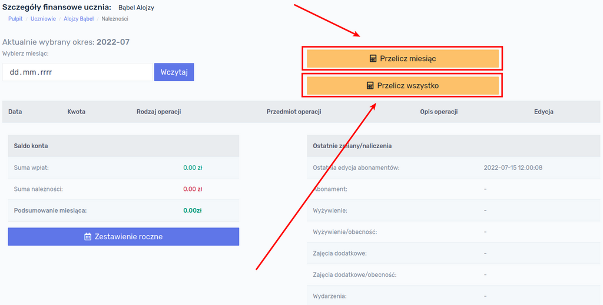

# Naliczanie opłat

Opłaty można naliczać indywidualnie dla jednego ucznia lub dla całych grup. 

## Naliczanie indywidualne

W celu naliczenia opłat tylko jednemu uczniowi, należy otworzyć listę uczniów i znaleźć w tabeli konkretną osobę, a następnie kliknąć przycisk `Należności`:

Na ekranie ukaże się podsumowanie salda ucznia za bieżący miesiąc. Aby sprawdzić stan należności za inny miesiąc, należy wybrać dowolną datę z kalendarza oraz kliknąć przycisk `Wczytaj`. Zostaną załadowane dane z wybranego miesiąca.

> Nie jest istotne jaki konkretnie dzień miesiąca wybierzemy. Np. po wybraniu 3 czerwca 2022 wyświetlą nam się operacje z całego czerwca 2022.

W celu naliczenia opłat za wybrany miesiąc klikamy przycisk `Przelicz miesiąc`.

!> **UWAGA!** Przycisk `Przelicz wszystko` dokonuje ponownego przeliczenia należności ucznia bez względu na wybrany miesiąc. Procedura uruchamiana tym przyciskiem usuwa wszystkie naliczenia abonamentów danego ucznia dokonane w przeszłości i nalicza je ponownie. Może to być przydatne w przypadku opisanym w rozdziale **[Usuwanie abonamentów ucznia](https://dok.infano.net/#/files/3-praca_z_programem?id=usuwanie-abonament%c3%b3w-ucznia)**.

Po kliknięciu przycisku `Przelicz miesiąc` ukaże się informacja o pomyślnym naliczeniu opłat dla danej osoby wraz ze wskazaniem okresu, który był przeliczany. 

Należy kliknąć przycisk `Wróć na poprzednią stronę`, zostaniemy przekierowani na stronę należności ucznia, na której pojawią się naliczone opłaty:

## Naliczanie grupowe

W celu naliczenia opłat dla całej grupy, należy kliknąć przycisk `Grupy` w menu głównym, następnie kliknąć na nazwie grupy, której chcemy naliczyć opłaty.  Po wyświetleniu informacji o grupie, należy przejść do zakładki `Operacje`:

Następnie należy wybrać miesiąc, za który chcemy dokonać naliczeń i kliknąć przycisk `Nalicz`. System naliczy opłaty i wyświetli stosowny komunikat wraz z listą osób, którym dokonano naliczeń:

!> **UWAGA!** W przypadku gdy dokonamy naliczenia kolejny raz w danym miesiącu, system usunie poprzednie wartości naliczeń i naliczy je ponownie, zgodnie z przypisanymi abonamentami i ich wartościami. Przy poprawnej konfiguracji abonamentów, nie ma możliwości, aby opłata została naliczona powtórnie.

> **Przykład 1:** dokonano naliczeń dla całej grupy za miesiąc lipiec 2022. Następnie przypisano nowego ucznia do tej grupy. <u>System nie naliczy automatycznie nowemu uczniowi należności!</u> Należy ponownie dokonać naliczenia opłat dla grupy.
>
> **Przykład 2:** dokonano naliczeń dla całej grupy za miesiąc lipiec 2022. Następnie zorientowano się, że wartość abonamentu jest błędna. Należy skorygować wartość abonamentu i dokonać ponownego naliczenia opłat dla grupy. Wszystkie wpisy z błędną wysokością czesnego zostaną usunięte i zastąpione nowymi wartościami.