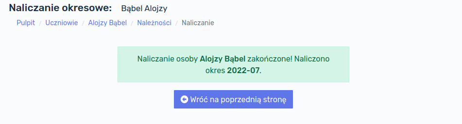
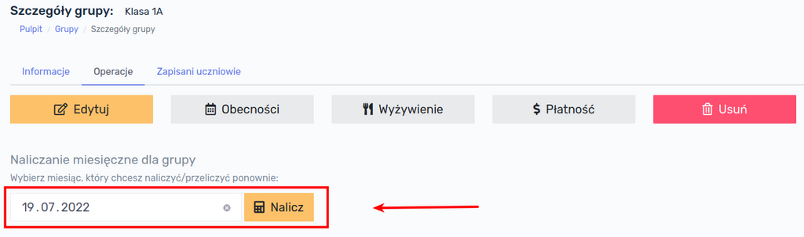

# Naliczanie opłat

Opłaty można naliczać indywidualnie dla jednego ucznia lub dla całych grup. 

## Naliczanie indywidualne

W celu naliczenia opłat tylko jednemu uczniowi, należy otworzyć listę uczniów i znaleźć w tabeli konkretną osobę, a następnie kliknąć przycisk `Należności`:

Na ekranie ukaże się podsumowanie salda ucznia za bieżący miesiąc. Aby sprawdzić stan należności za inny miesiąc, należy wybrać dowolną datę z kalendarza oraz kliknąć przycisk `Wczytaj`. Zostaną załadowane dane z wybranego miesiąca.

> Nie jest istotne jaki konkretnie dzień miesiąca wybierzemy. Np. po wybraniu 3 czerwca 2022 wyświetlą nam się operacje z całego czerwca 2022.

W celu naliczenia opłat za wybrany miesiąc klikamy przycisk `Przelicz miesiąc`.

!> **UWAGA!** Przycisk `Przelicz wszystko` dokonuje ponownego przeliczenia należności ucznia bez względu na wybrany miesiąc. Procedura uruchamiana tym przyciskiem usuwa wszystkie naliczenia abonamentów danego ucznia dokonane w przeszłości i nalicza je ponownie. Może to być przydatne w przypadku opisanym w rozdziale **[Usuwanie abonamentów ucznia](https://dok.infano.net/#/files/3-praca_z_programem?id=usuwanie-abonament%c3%b3w-ucznia)**.

Po kliknięciu przycisku `Przelicz miesiąc` ukaże się informacja o pomyślnym naliczeniu opłat dla danej osoby wraz ze wskazaniem okresu, który był przeliczany. 

Należy kliknąć przycisk `Wróć na poprzednią stronę`, zostaniemy przekierowani na stronę należności ucznia, na której pojawią się naliczone opłaty:

## Naliczanie grupowe

W celu naliczenia opłat dla całej grupy, należy kliknąć przycisk `Grupy` w menu głównym, następnie kliknąć na nazwie grupy, której chcemy naliczyć opłaty.  Po wyświetleniu informacji o grupie, należy przejść do zakładki `Operacje`:

Następnie należy wybrać miesiąc, za który chcemy dokonać naliczeń i kliknąć przycisk `Nalicz`. System naliczy opłaty i wyświetli stosowny komunikat wraz z listą osób, którym dokonano naliczeń:

!> **UWAGA!** W przypadku gdy dokonamy naliczenia kolejny raz w danym miesiącu, system usunie poprzednie wartości naliczeń i naliczy je ponownie, zgodnie z przypisanymi abonamentami i ich wartościami. Przy poprawnej konfiguracji abonamentów, nie ma możliwości, aby opłata została naliczona powtórnie.

> **Przykład 1:** dokonano naliczeń dla całej grupy za miesiąc lipiec 2022. Następnie przypisano nowego ucznia do tej grupy. <u>System nie naliczy automatycznie nowemu uczniowi należności!</u> Należy ponownie dokonać naliczenia opłat dla grupy.
>
> **Przykład 2:** dokonano naliczeń dla całej grupy za miesiąc lipiec 2022. Następnie zorientowano się, że wartość abonamentu jest błędna. Należy skorygować wartość abonamentu i dokonać ponownego naliczenia opłat dla grupy. Wszystkie wpisy z błędną wysokością czesnego zostaną usunięte i zastąpione nowymi wartościami.

## Naliczanie opłat za wydarzenia

Istnieje możliwość naliczenia jednorazowej opłaty, która nie jest powiązana z abonamentem miesięcznym ani z obecnością ucznia. Rozwiązanie to jest przydatne gdy chcemy naliczyć uczniowi np. koszty wycieczki, wyjścia do kina lub zorganizowania mikołajek. Tego typu opłata została sklasyfikowana w aplikacji jako "Wydarzenie". Opłaty za jednorazowe wydarzenia można naliczać indywidualnie dla ucznia lub dla całych grup.

### Wydarzenia - naliczanie indywidualne

W celu naliczenia opłaty za wydarzenie należy przejść do listy uczniów i kliknąć przycisk `Wpłaty` przy uczniu, któremu chcemy naliczyć opłatę:

Następnie należy kliknąć przycisk `Dodaj nową wpłatę`:

Otworzy się okno z formularzem dodania wpłaty ucznia. Formularz zawiera następujące pola:

- **Typ** - określa za co jest dokonywana wpłata; pole to ma charakter wyłącznie informacyjny i pozwala na łatwiejszą identyfikację wpłat na zestawieniu finansowym ucznia; jego wybór nie wpływa w żaden sposób na rozliczenie,
  - **Czesne miesięczne** - przypisuje wpłatę za standardowe czesne,
  - **Wyżywienie miesięczne** - przypisuje wpłatę za wyżywienie miesięczne,
  - **Wyżywienie za obecność** - przypisuje wpłatę za wyżywienie za obecność,
  - **Wydarzenie** - przypisuje wpłatę za jednorazowe wydarzenie np. wycieczka, mikołajki, wyjście do kina itp.,
  - **Lekcje dodatkowe (miesięczne)** - przypisuje wpłatę do lekcji dodatkowych,
  - **Lekcje dodatkowe (za obecność)** - przypisuje wpłatę do lekcji dodatkowych,
  - **Inny rodzaj** - można wykorzystać do przypisania wpłaty innego rodzaju,
- **Rodzaj**
  - **Wpłata** - wskazuje, że uczeń wpłaca pieniądze, co skutkuje pomniejszeniem jego zadłużenia,
  - **Należność** - opcja pozwalająca na jednorazowe dopisanie do rachunku ucznia jakiejś należności; wybranie tego rodzaju powoduje zwiększenie zadłużenia ucznia,
- **Data wpłaty** - wskazuje dokładną datę dokonania wpłaty,
- **Za miesiąc** - określa za jaki okres rozliczeniowy wpłata jest dokonywana; wybranie konkretnej daty, np. 15 lipca 2022 roku, skutkuje zaliczenie wpłaty na poczet lipca 2022,
- **Kwota** - kwota jaka jest wpłacana,
- **Opis** - pozwala dopisać uwagi, np.: *gotówka do kasy* lub *przelew bankowy z dnia 13-07-2022*.

!> **UWAGA!** W przypadku tworzenia jednorazowego wydarzenia, bardzo istotne jest zaznaczenie pola **Rodzaj** jako **Należność**.

Po wypełnieniu formularza, klikamy przycisk `Zapisz` - należność zostaje dodana do bazy danych.

!> UWAGA! Należność nie jest widoczna na liście wpłat, ponieważ nie jest wpłatą! Należność można zobaczyć na zestawieniu miesięcznym ucznia (`Uczniowie` → `Należności`).

### Wydarzenia - naliczanie grupowe

Aplikacja Infano posiada mechanizm ułatwiający dokonywanie naliczeń za wydarzenia dla całej grupy (lub dla części osób z grupy). W tym celu należy przejść do listy grup (klikając w głównym menu przycisk `Grupy`), kliknąć w nazwę danej grupy i przejść na zakładkę `Operacje`, a następnie kliknąć przycisk `Płatność`:

Otworzy się okno formularza pozwalającego naliczyć wydarzenie dla całej grupy lub wybranych osób z grupy. Formularz zawiera pola:

- **Tytuł płatności** - należy podać opis czego płatność dotyczy
- **Za miesiąc** - należy wpisać dowolną datę z miesiąca, którego wydarzenie dotyczy
- **Kwota** - należy wpisać koszt wydarzenia

Klikając w checkboxy można zaznaczyć osoby, którym wydarzenie ma zostać naliczone. Po wypełnieniu formularza, klikamy przycisk `Zapisz` - dane zostają zapisane w bazie danych.