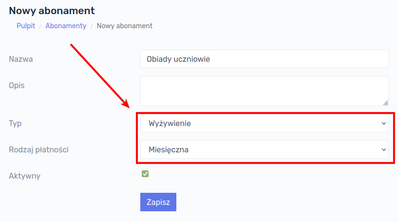
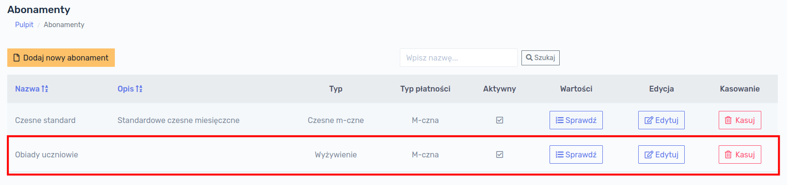
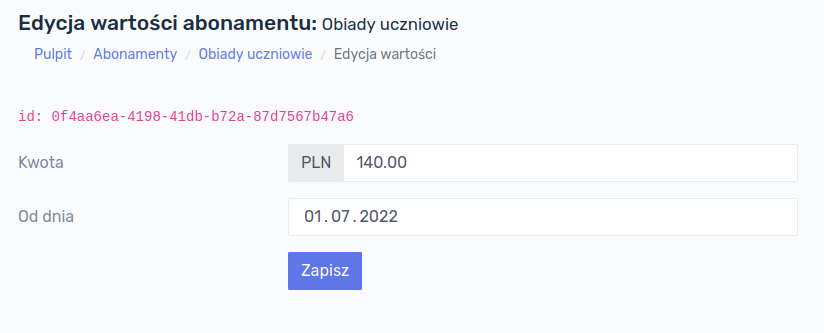
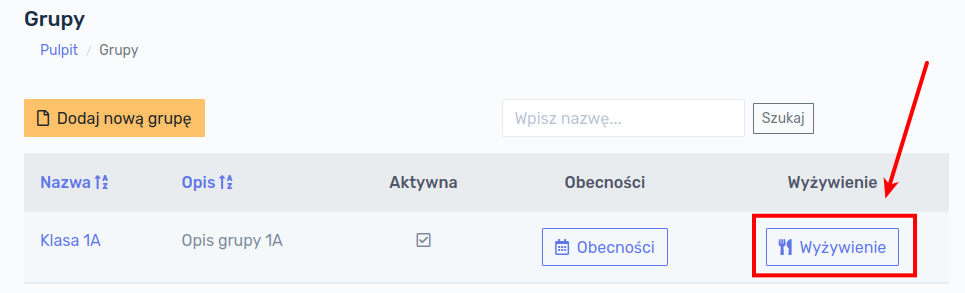
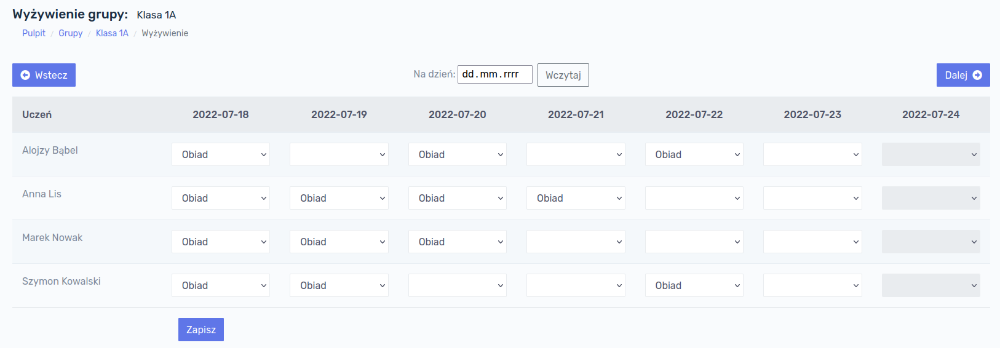

# Wyżywienie

Wyżywienie w programie może być naliczane na 3 sposoby:

- **miesięcznie** - stała kwota za dany miesiąc, która może być inna w każdym miesiącu
- **za dzień** - stała kwota za dzień, w którym uczeń zjadł posiłek
- **zależnie od wybranego posiłku** - przypadek, w którym opłata może być każdego dnia inna w zależności jakiego wyboru dokonał uczeń, np. jednego dnia zupa za 5 zł, drugiego zupa + II danie 15 zł, trzeciego dnia tylko II danie za 10zł.

## Miesięczne

Ustawienie wyżywienia naliczanego jeden raz w danym miesiącu jest bardzo podobne jak w przypadku standardowego abonamentu za czesne. Klikamy w menu głównym w przycisk `Abonamenty` → `Dodaj nowy abonament`i wypełniamy formularz, zaznaczając `Typ` jako `Wyżywienie`, a `Rodzaj płatności` jako `Miesięczna`:

Należy pamiętać, aby pole `Aktywny` było zaznaczone. Zatwierdzamy przyciskiem `Zapisz` i przechodzimy na listę abonamentów, gdzie powinien znajdować się już abonament z typem `Wyżywienie`:

W kolejnym kroku należy nadać wartość temu abonamentowi. Dokonujemy tego tak samo jak w przypadku czesnego. Klikamy kolejno `Sprawdź` → `Dodaj nową wartość`, następnie wpisujemy kwotę oraz datę rozpoczęcia okresu od którego abonament obowiązuje, np.:

Zatwierdzamy przyciskiem `Zapisz`. 

Ostatnią rzeczą jest przypisanie abonamentu uczniowi, analogicznie jak w przypadku czesnego, klikając kolejno: `Uczniowie` → `Abonamenty` (przy konkretnym uczniu) → `Dodaj nowy`. Następnie należy wybrać z listy rozwijanej abonament, który utworzyliśmy i uzupełnić datę, od której przypisujemy go uczniowi.

### Naliczanie wyżywienia miesięcznego

Naliczenia wartości za wyżywienie miesięczne można dokonać:

- indywidualnie dla ucznia: `Uczniowie` → kliknąć na nazwisku ucznia → zakładka `Operacje` → przycisk `Należności` → przycisk `Przelicz wszystko`
- grupowo: `Grupy` → kliknąć na nazwie grupy → zakładka `Operacje` → przycisk `Nalicz`

## Za dzień

Wyżywienie może być także naliczane stałą kwotą za dzień.

> **Przykład:** chcemy naliczać opłatę za wyżywienie tylko za dni, w których uczeń przebywał w placówce.

Aby utworzyć tego typu abonament, klikamy w menu głównym w przycisk `Abonamenty` → `Dodaj nowy abonament`i wypełniamy formularz, zaznaczając `Typ` jako `Wyżywienie`, a `Rodzaj płatności` jako `Za obecność`:

W kolejnym kroku należy nadać wartość temu abonamentowi. Dokonujemy tego tak samo jak w przypadku czesnego. Klikamy kolejno `Sprawdź` → `Dodaj nową wartość`, następnie wpisujemy kwotę oraz datę rozpoczęcia okresu od którego abonament obowiązuje, np.:

Zatwierdzamy przyciskiem `Zapisz`. 

!> UWAGA! Abonamentu **Wyżywienie** z rodzajem płatności **Za obecność** nie musimy przypisywać do ucznia! 

### Przypisanie żywności za dzień

Aby naliczyć żywność za dzień, w którym uczeń był obecny, należy przejść do menu Grup i przy żądanej grupie kliknąć przycisk `Wyżywienie`:

Otworzy się okno z kalendarzem, w którym możemy przypisać posiłek w konkretnym dniu. Na liście znajdują się wszyscy uczniowie przypisani do grupy, którą wybraliśmy:

Należy przy danym uczniu i dacie wybrać z listy rozwijanej posiłek, który w rzeczywistości jest nazwą wcześniej utworzonego abonamentu. Po kliknięciu przycisku `Zapisz` dane zostają zapisane w bazie danych. Możemy przesuwać się w kalendarzu do przodu i do tyłu posługując się przyciskami `Wstecz` oraz `Dalej` lub opcjonalnie przejść do dowolnego okresu wybierając datę z kalendarza.

!> **UWAGA!** Aby opłaty za poszczególne posiłki zostały naliczone uczniom, należy je naliczyć indywidualnie konkretnym uczniom lub dokonać naliczenia dla całej grupy (patrz niżej).

### Naliczanie wyżywienia za dzień

Naliczenia wartości za wyżywienie miesięczne można dokonać:

- indywidualnie dla ucznia: `Uczniowie` → kliknąć na nazwisku ucznia → zakładka `Operacje` → przycisk `Należności` → przycisk `Przelicz wszystko`

- grupowo: `Grupy` → kliknąć na nazwie grupy → zakładka `Operacje` → przycisk `Nalicz`

  

## Zależne od posiłku

Jeśli chcemy uzależnić wysokość opłaty od posiłku, można tego dokonać tworząc kilka abonamentów, np.:

- Zupa - w cenie 5 zł
- II danie w cenie 15 zł
- I i II danie w cenie 20 zł

Te abonamenty wraz z wartościami tworzymy analogicznie jak w przypadku naliczania żywności za dzień (patrz wyżej). 

### Przypisanie żywności zależnej od posiłku

Aby przypisać dany posiłek konkretnemu uczniowi należy przejść do menu Grup i przy żądanej grupie kliknąć przycisk `Wyżywienie`:

Ostatnim krokiem jest wybranie odpowiednich opcji przy danym uczniu:

!> **UWAGA!** Należy pamiętać, że na powyższym ekranie następuje przypisanie uczniowi danego posiłku w konkretnych dniach. Naliczenia dokonujemy indywidualnie dla ucznia albo grupowo dla całej grupy (patrz niżej).

### Naliczanie wyżywienia zależnego od posiłku

Naliczenia wartości za wyżywienie miesięczne można dokonać:

- indywidualnie dla ucznia: `Uczniowie` → kliknąć na nazwisku ucznia → zakładka `Operacje` → przycisk `Należności` → przycisk `Przelicz wszystko`
- grupowo: `Grupy` → kliknąć na nazwie grupy → zakładka `Operacje` → przycisk `Nalicz`

