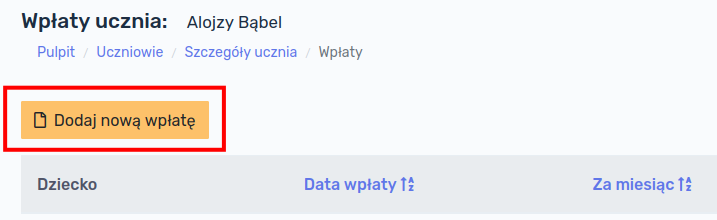
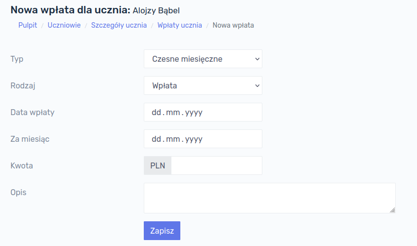
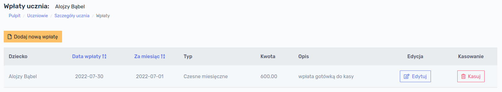
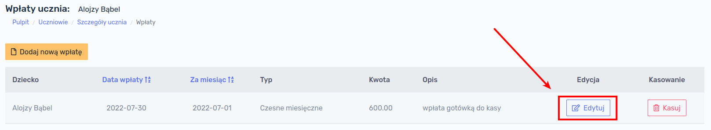

## Przyjmowanie wpłat

W celu przyjęcia wpłaty od ucznia należy wyświetlić listę uczniów i przy nazwisku konkretnego ucznia kliknąć przycisk `Wpłaty`:

Następnie należy kliknąć przycisk `Dodaj nową wpłatę`:

Otworzy się okno z formularzem dodania wpłaty ucznia. Formularz zawiera następujące pola:

- **Typ** - określa za co jest dokonywana wpłata; pole to ma charakter wyłącznie informacyjny i pozwala na łatwiejszą identyfikację wpłat na zestawieniu finansowym ucznia; jego wybór nie wpływa w żaden sposób na rozliczenie,
  - **Czesne miesięczne** - przypisuje wpłatę za standardowe czesne,
  - **Wyżywienie miesięczne** - przypisuje wpłatę za wyżywienie miesięczne,
  - **Wyżywienie za obecność** - przypisuje wpłatę za wyżywienie za obecność,
  - **Wydarzenie** - przypisuje wpłatę za jednorazowe wydarzenie np. wycieczka, mikołajki, wyjście do kina itp.,
  - **Lekcje dodatkowe (miesięczne)** - przypisuje wpłatę do lekcji dodatkowych,
  - **Lekcje dodatkowe (za obecność)** - przypisuje wpłatę do lekcji dodatkowych,
  - **Inny rodzaj** - można wykorzystać do przypisania wpłaty innego rodzaju,
- **Rodzaj**
  - **Wpłata** - wskazuje, że uczeń wpłaca pieniądze, co skutkuje pomniejszeniem jego zadłużenia,
  - **Należność** - opcja pozwalająca na jednorazowe dopisanie do rachunku ucznia jakiejś należności; wybranie tego rodzaju powoduje zwiększenie zadłużenia ucznia,
- **Data wpłaty** - wskazuje dokładną datę dokonania wpłaty,
- **Za miesiąc** - określa za jaki okres rozliczeniowy wpłata jest dokonywana; wybranie konkretnej daty, np. 15 lipca 2022 roku, skutkuje zaliczenie wpłaty na poczet lipca 2022,
- **Kwota** - kwota jaka jest wpłacana,
- **Opis** - pozwala dopisać uwagi, np.: *gotówka do kasy* lub *przelew bankowy z dnia 13-07-2022*.

Po wypełnieniu formularza, klikamy przycisk `Zapisz` - wpłata zostaje dodana do bazy danych.

## Przeglądanie wpłat

W celu przeglądania wpłat ucznia należy wyświetlić listę uczniów i przy nazwisku konkretnego ucznia kliknąć przycisk `Wpłaty`:

Wyświetli się szczegółowa lista wpłat danego ucznia:

## Edycja wpłaty

W sytuacji gdy popełnimy pomyłkę podczas wpłaty, np. wpiszemy złą kwotę, datę lub okres, którego wpłata dotyczy, możemy poprawić wpłatę. W tym celu na liście wpłat ucznia klikamy przycisk `Edytuj`, przy pozycji, którą chcemy skorygować:

Wyświetli nam się formularz identyczny jak w przypadku tworzenia nowej wpłaty. Formularz będzie zawierał wszystkie dane wpłaty wcześniej zapisane. Po dokonaniu poprawek klikamy przycisk `Zapisz`.

## Usuwanie wpłaty

W przypadku gdy chcemy całkowicie usunąć wpłatę ucznia (np. dodaną przez pomyłkę nie temu uczniowi), na liście wpłat należy kliknąć przycisk `Kasuj`. Wpłata zostanie usunięta.

