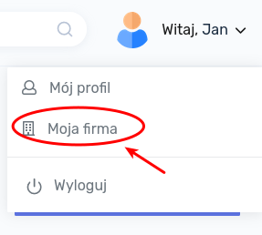

# Pierwsze kroki

## Uzupełnienie profilu

Po poprawnym zalogowaniu się do aplikacji należy uzupełnić profil firmy. Można tego dokonać klikając w prawym górnym rogu na nazwie użytkownika i wybierając pozycję "Moja firma".

