# Praca z programem

## Grupy

Pracę z programem można rozpocząć od stworzenia grup. Grupy służą uporządkowaniu uczniów i są w pewnym sensie odpowiednikiem klas w szkole. Aby wyświetlić listę grup należy w głównym menu po lewej stronie ekranu kliknąć przycisk  `Grupy`.

Po kliknięciu przycisku `Grupy` wyświetli się ekran z istniejącymi grupami.

!> W przypadku rozpoczęcia pracy z programem baza danych jest pusta i żadne grupy nie wyświetlają się na tym ekranie.

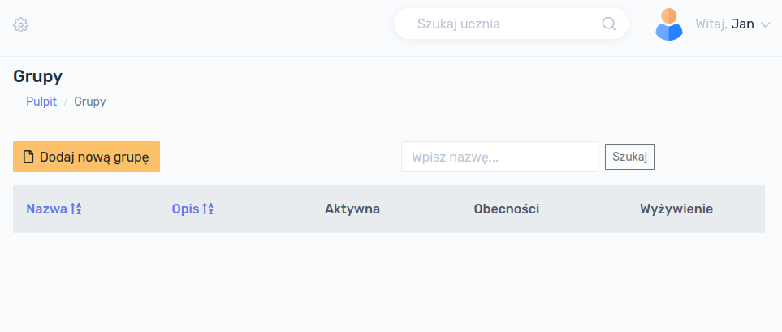

### Dodawanie grupy

W celu dodania nowej grupy należy kliknąć w przycisk `Dodaj nową grupę`:

Formularz, który się wyświetli zawiera następujące pola:

- **Nazwa grupy** - pole **<u>wymagane</u>**
- **Opis grupy** - pole **<u>opcjonalne</u>**
- **Aktywna** - określa, czy grupa jest aktywna (opis poniżej), pole **<u>opcjonalne</u>**

> **Aktywność** grupy oznacza wyświetlanie się jej na listach w innych modułach programu. Do grupy która nie jest aktywna nie można przypisać ucznia.

Po wypełnieniu formularza, klikamy przycisk `Zapisz`, następuje zapisanie informacji o grupie do bazy danych. Po ponownym Kliknięciu w przycisk `Grupy` w głównym menu, nowo dodana grupa będzie widoczna:

### Szczegóły grupy

W celu wyświetlenia szczegółów grupy należy kliknąć w nazwę konkretnej grupy na liście grup.

Wyświetli nam się informacja o grupie, tj. jej nazwa, opis oraz status (aktywna czy nie). 

### Edycja grupy

W celu dokonania edycji danych grupy, np. zmiany jej nazwy, opisu lub statusu aktywności, należy przejść do zakładki `Operacje`, a następnie kliknąć przycisk `Edytuj`:

Otworzy nam się formularz edycji grupy, analogiczny jak w przypadku Dodawania grupy. Po wprowadzeniu ewentualnych zmian można je zapisać klikając przycisk `Zapisz`.

### Usuwanie grupy

W celu usunięcia grupy należy przejść do zakładki `Operacje`, a następnie kliknąć przycisk `Usuń`.

!> **UWAGA!!! Usunięcie grupy jest operacją nieodwracalną!** Grupy nie można usunąć jeśli są do niej przypisani uczniowie.

## Uczniowie

Kolejnym etapem pracy z programem jest dodanie uczniów. Aby wyświetlić listę grup należy w głównym menu po lewej stronie ekranu kliknąć przycisk  `Uczniowie`.

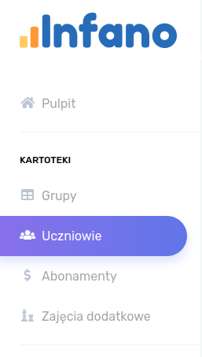

Po kliknięciu przycisku `Uczniowie` wyświetli się ekran z istniejącymi w bazie danych uczniami.

!> W przypadku rozpoczęcia pracy z programem baza danych jest pusta i nie wyświetli żadnego ucznia.

### Dodawanie ucznia

W celu dodania do bazy danych nowego ucznia należy kliknąć w przycisk `Dodaj nowego ucznia`:

Formularz, który się wyświetli zawiera poniższe pola.

Pola wymagane:

- **Nazwisko**
- **Imię** 

Pola opcjonalne:

- Ulica
- Kod pocztowy
- Miejscowość
- Adres zamieszkania
- Data urodzenia
- PESEL
- Telefon
- Dodatkowy telefon
- Uwagi
- Adres e-mail
- Grupa
- Checkbox *Aktywny*

> **Aktywność** ucznia oznacza, że uczeń będzie wyświetlał się na różnych listach w innych modułach programu. Odznaczenie tego pola oznacza, że nie można mu przypisać np. żadnego abonamentu, zajęć dodatkowych itd.

> **Grupa** może być przypisana uczniowi lecz nie jest to konieczne. Dowolność tej opcji służy temu, aby można było wcześniej przygotować kartoteki uczniów np. przed rozpoczęciem zajęć lub roku szkolnego.

W celu dodania ucznia do bazy danych należy kliknąć przycisk `Zapisz`.

Po ponownym Kliknięciu przycisku `Uczniowie` w głównym menu, nowo dodany uczeń będzie widoczny na liście uczniów

### Szczegóły ucznia

W celu wyświetlenia szczegółów ucznia, należy kliknąć w jego nazwisko na liście uczniów.

Po kliknięciu w nazwisko wyświetli się ekran ze szczegółami ucznia:

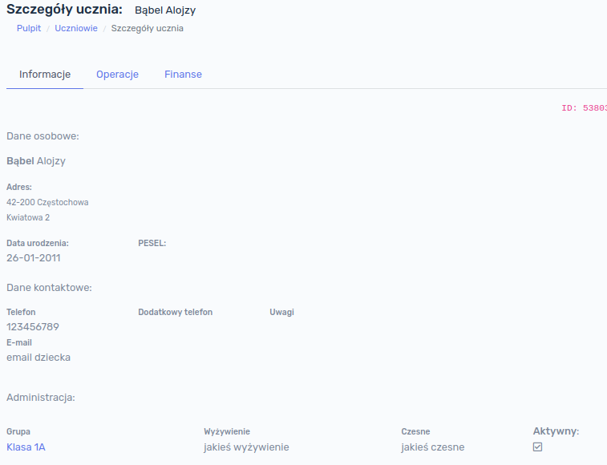

### Edycja ucznia

W celu dokonania edycji danych ucznia, np. zmiany adresu, grupy lub statusu aktywności, należy wyświetlić szczegóły ucznia, a następnie przejść do zakładki `Operacje` oraz kliknąć przycisk `Edytuj`:

Otworzy nam się formularz edycji danych ucznia, analogiczny jak w przypadku dodawania nowego ucznia. Po wprowadzeniu ewentualnych zmian można je zapisać klikając przycisk `Zapisz`.

### Usuwanie ucznia

W celu usunięcia ucznia należy przejść do zakładki `Operacje`, a następnie kliknąć przycisk `Usuń`.

!> **UWAGA!!! Usunięcie ucznia jest operacją nieodwracalną!** Ucznia nie można usunąć jeśli dokonano jakiegokolwiek naliczenia (np. wcześniej naliczono jakiś abonament, wyżywienie lub zajęcia dodatkowe).

### Należności ucznia

W celu sprawdzenia stanu należności ucznia należy kliknąć w głównym menu przycisk `Uczniowie`, a następnie `Należności`:

Wyświetli nam się stan należności ucznia:

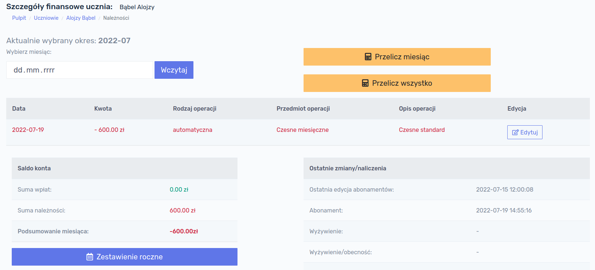

Okno zawiera wpisy dokonane w bieżącym miesiącu. W celu sprawdzenia innego miesiąca należy wybrać dowolną datę z kalendarza i kliknąć przycisk `Wczytaj`. 

!> UWAGA! Wybranie konkretnego dnia nie ma znaczenia w tym raporcie. Np. wybierając 2-go maja 2022 wczytamy wszystkie wpisy z maja 2022.

W celu sprawdzenia wpisów z całego roku, należy kliknąć przycisk `Zestawienie roczne`, otworzy się okno zawierające podsumowanie z całego roku:

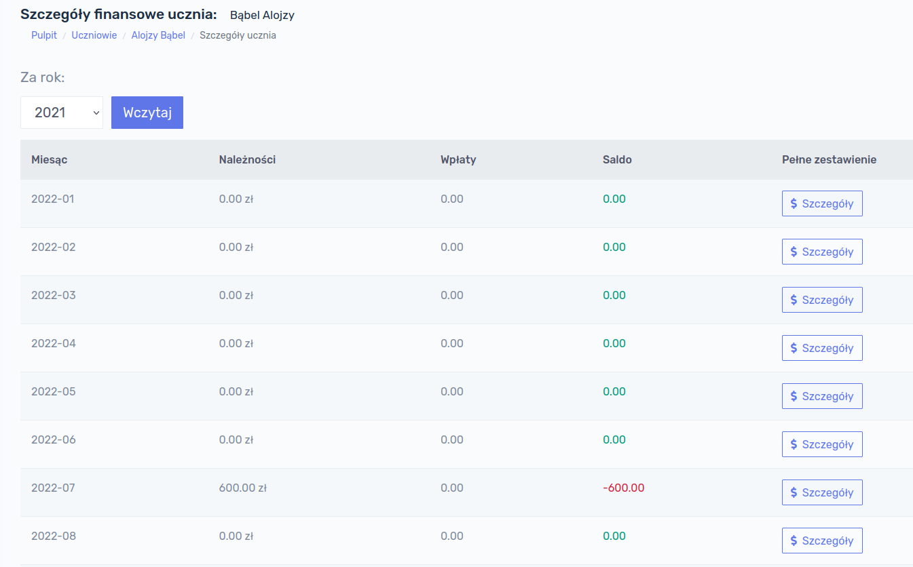

W celu szybkiego przejścia do danego miesiąca, klikamy przycisk `Szczegóły` przy interesującym nas miesiącu.

## Abonamenty

Aby program mógł poprawnie dokonywać naliczeń należy skonfigurować odpowiednio abonamenty. W celu wyświetlenia listy abonamentów, należy kliknąć, w głównym menu po lewej stronie ekranu, przycisk `Abonamenty`:

Po kliknięciu przycisku `Abonamenty` wyświetli się ekran z istniejącymi w bazie danych abonamentami.

!> W przypadku rozpoczęcia pracy z programem baza danych jest pusta i nie wyświetli żadnego abonamentu.

### Dodawanie abonamentu

W celu dodania do bazy danych nowego abonamentu należy kliknąć w przycisk `Dodaj nowy abonament`:

Formularz, który się wyświetli zawiera poniższe pola.

Pola wymagane:

- **Nazwa**
- **Typ** 

Pola opcjonalne:

- Opis
- Checkbox *Aktywny*

> **Aktywność** abonamentu oznacza, że abonament będzie wyświetlał się na różnych listach w innych modułach programu. Odznaczenie tego pola oznacza, że nie będzie można przypisać tego abonamentu żadnemu uczniowi.

Po wypełnieniu formularza i kliknięciu przycisku `Zapisz`, abonament zostaje dodany do bazy danych.

### Typy abonamentów

Wyróżniamy następujące typy abonamentów:

- **Czesne miesięczne** - jest to standardowe czesne o stałej kwocie naliczane raz w miesiącu
- **Wyżywienie** - jest to abonament umożliwiający naliczanie opłat związanych z wyżywieniem. Może on być naliczany na dwa sposoby w zależności od wybranego rodzaju płatności:
  - **miesięcznie** - zostanie naliczona stała kwota jeden raz w miesiącu
  - **za obecność** - zostanie naliczona stawka dzienna za dni, w których uczeń był obecny i korzystał z wyżywienia.
- **Zajęcia dodatkowe** -  jest to abonament umożliwiający naliczanie opłat związanych z zajęciami dodatkowymi. Podobnie jak w przypadku wyżywienia, może on być naliczany na dwa sposoby w zależności od wybranego rodzaju płatności:
  - **miesięcznie** - zostanie naliczona stała kwota jeden raz w miesiącu
  - **za obecność** - zostanie naliczona stawka dzienna za dni, w których uczeń był obecny i korzystał z wyżywienia.

Nic nie stoi na przeszkodzie tworzenia wielu różnych abonamentów i konfigurowania ich w dowolny sposób.

> **Przykład:** Uczeń może mieć przypisane abonamenty:
>
> - stałe czesne miesięczne nie związane z żadnymi obecnościami w kwocie 600 zł,
> - wyżywienie 20 zł za dzień obecności
> - dodatkowe zajęcia z j. angielskiego w stałej kwocie miesięcznej 200 zł
> - dodatkowe zajęcia z robotyki w kwocie 40 zł za obecność

!> UWAGA! Standardowe pole formularza dodawania abonamentów, nie zawiera pola `Rodzaj płatności` - to pole pojawia się dopiero po wybraniu w polu `Typ` pozycji `Wyżywienie` lub `Zajęcia dodatkowe`.

### Edycja abonamentu

W celu edycji abonamentu, należy wybrać kolejno `Abonamenty` z menu głównego, a następnie kliknąć przycisk `Edytuj`:

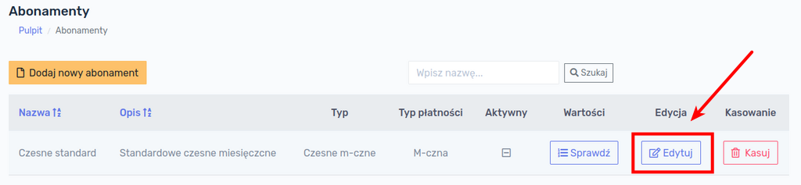

Otworzy się formularz analogiczny jak w przypadku dodawania nowego abonamentu. Po naniesieniu zmian, należy kliknąć w przycisk `Zapisz`.

### Wartości abonamentu

Aby poprawnie naliczyć uczniowi abonament, **każdy abonament musi mieć przypisaną wartość**. W celu sprawdzenia jakie wartości są przypisane do abonamentu należy na liście abonamentów kliknąć przycisk `Sprawdź` w kolumnie `Wartości`:

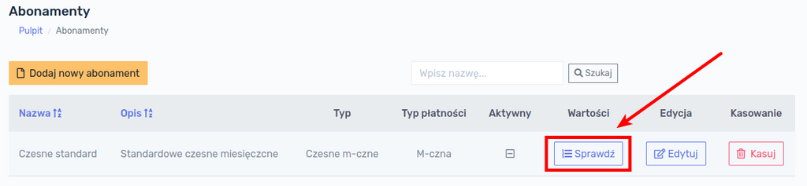

Przy rozpoczęciu pracy z programem lista będzie pusta. Aby dodać nową wartość abonamentu klikamy przycisk `Dodaj nową wartość`:

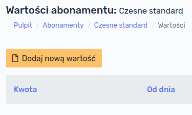

Wyświetli się formularz dodania wartości abonamentu, który zawiera dwa pola:

- **Kwota** - wyrażona w zł
- **Od dnia** - data od której dana wartość obowiązuje

Po wprowadzeniu kwoty oraz daty, od której abonament obowiązuje, klikamy przycisk `Zapisz`. Aby sprawdzić wartości abonamentu należy kliknąć kolejno `Abonamenty` (w menu głównym) → `Sprawdź` w kolumnie Wartości przy odpowiednim abonamencie. Na ekranie wyświetlone zostaną wartości danego abonamentu:

W tym miejscu możemy dodać nową wartość (np. podnosimy wysokość czesnego z 500 zł na 600 zł od 1-go września) lub dokonać edycji istniejącej wartości. W celu edycji istniejącej wartości klikamy przycisk `Edytuj` przy interesującej nas pozycji. Po kliknięciu przycisku `Edytuj` wyświetli się analogiczne okno jak przy tworzeniu nowej wartości.

Rozwiązanie to pozwala na zmianę wartości abonamentu w dowolnym momencie.

>  **Przykład:** Mamy abonament "Czesne podstawowe" z przypisaną wartością 500 zł od 1-go stycznia 2022. Chcemy zwiększyć wysokość czesnego od 1-go września 2022. Dodajemy nową wartość 600 zł i datę rozpoczęcia 1 września 2022.  System od stycznia do sierpnia włącznie naliczy 500 zł, a od września zacznie naliczać 600 zł.

### Edycja wartości abonamentu

W przypadku gdy popełnimy błąd przy określaniu wartości abonamentu, można dokonać korekty klikając kolejno na przyciski `Abonamenty` w menu głównym, a następnie `Sprawdź` przy konkretnym abonamencie:

Na następnym ekranie wyświetlą się wartości danego abonamentu, należy kliknąć przycisk `Edytuj`. 

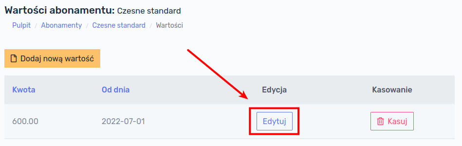

Otworzy się okno analogiczne jak w przypadku dodawania nowej wartości. Należy dokonać stosownych zmian i zatwierdzić zmiany przyciskiem `Zapisz`.

!> UWAGA! Jeśli korekta wartości została dokonana po naliczeniu opłat, **należy ponownie przeliczyć opłaty** za miesiące, których ten abonament dotyczy!

### Przypisanie abonamentu do ucznia

Aby przypisać abonament uczniowi, należy:

1. wyświetlić listę uczniów  (główne menu →`Uczniowie`) :

2. kliknąć przycisk `Abonamenty` przy konkretnej osobie:

3. wyświetli się lista abonamentów przypisanych uczniowi; w przypadku nowego ucznia, lista będzie pusta. W tym miejscu należy kliknąć przycisk `Dodaj nowy`

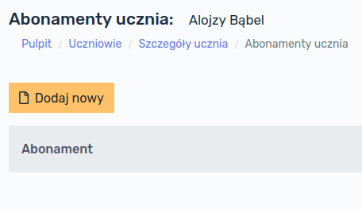

4. wyświetli się formularz przypisania wcześniej utworzonego abonamentu uczniowi:

   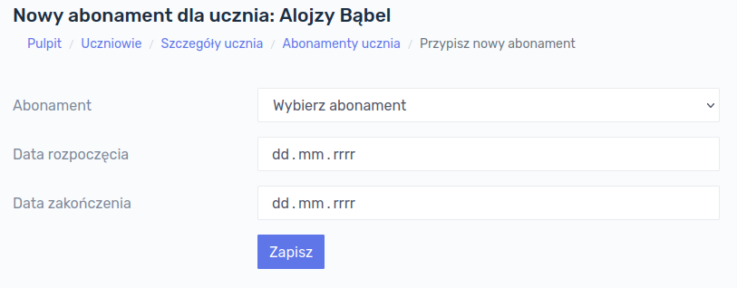

Z rozwijanej listy należy wybrać **właściwy abonament**, który chcemy przypisać uczniowi oraz **datę** od której abonament ma być uczniowi naliczany.

> **Przykład:** Jest <u>czerwiec 2022</u> roku i mamy nowych uczniów zapisanych do placówki <u>od września 2022</u> roku. Przygotowujemy sobie kartotekę uczniów  wcześniej, przypisujemy nowym uczniom abonamenty i określamy datę rozpoczęcia na 1 września 2022. Podczas dokonywania naliczeń w czerwcu nowym uczniom nie zostanie naliczony ten abonament, gdyż jego naliczanie rozpocznie się dopiero od <u>września 2022</u>.

Po wypełnieniu formularza klikamy przycisk `Zapisz`. Abonament został przypisany uczniowi. 

### Wyświetlanie abonamentów ucznia

Aby wyświetlić abonamenty przypisane uczniowi, należy wyświetlić listę uczniów  (główne menu →`Uczniowie`) , a następnie kliknąć przycisk `Abonamenty` przy konkretnej osobie:

Wyświetlą nam się przypisane uczniowi wszystkie abonamenty wraz z datami rozpoczęcia i zakończenia:

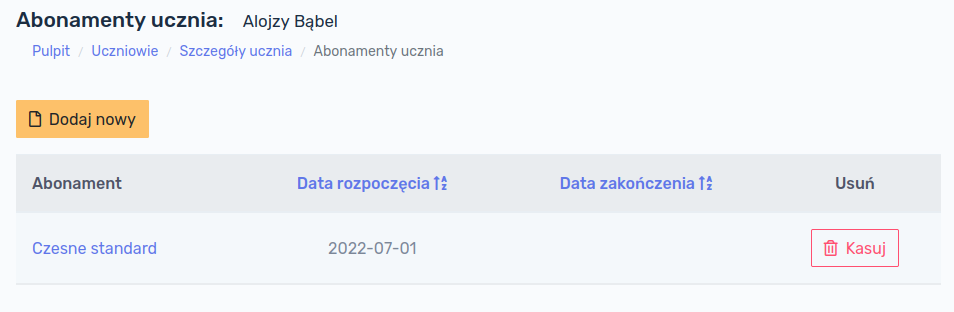

### Usuwanie abonamentów ucznia

W celu usunięcia abonamentu uczniowi należy wyświetlić listę abonamentów przypisanych temu uczniowi i kliknąć przycisk `Kasuj`.

!> **Uwaga!** Usunięcie abonamentu oznacza, że ten abonament nie zostanie naliczony uczniowi. Jeśli jednak został naliczony w poprzednich miesiącach i zostanie w tym miejscu usunięty (a więc odłączony od ucznia) **dokonane wcześniej naliczenia pozostaną**!

**Przykład:** W maju 2022 roku przypisano uczniowi abonament i dokonano jego naliczenia. W czerwcu zorientowano się, że abonament był przypisany uczniowi przez pomyłkę i go usunięto. Naliczona należność za maj pozostaje na saldzie ucznia. Aby ją usunąć należy ponownie przeliczyć maj.

## Naliczanie opłat

Opłaty można naliczać indywidualnie dla jednego ucznia lub dla całych grup. 

### Naliczanie indywidualne

W celu naliczenia opłat tylko jednemu uczniowi, należy otworzyć listę uczniów i znaleźć w tabeli konkretną osobę, a następnie kliknąć przycisk `Należności`:

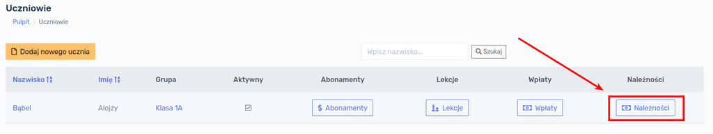

Na ekranie ukaże się podsumowanie salda ucznia za bieżący miesiąc. Aby sprawdzić stan należności za inny miesiąc, należy wybrać dowolną datę z kalendarza oraz kliknąć przycisk `Wczytaj`. Zostaną załadowane dane z wybranego miesiąca.

> Nie jest istotne jaki konkretnie dzień miesiąca wybierzemy. Np. po wybraniu 3 czerwca 2022 wyświetlą nam się operacje z całego czerwca 2022.

W celu naliczenia opłat za wybrany miesiąc klikamy przycisk `Przelicz miesiąc`.

!> **UWAGA!** Przycisk `Przelicz wszystko` dokonuje ponownego przeliczenia należności ucznia bez względu na wybrany miesiąc. Procedura uruchamiana tym przyciskiem usuwa wszystkie naliczenia abonamentów danego ucznia dokonane w przeszłości i nalicza je ponownie. Może to być przydatne w przypadku opisanym w rozdziale **[Usuwanie abonamentów ucznia](https://dok.infano.net/#/files/3-praca_z_programem?id=usuwanie-abonament%c3%b3w-ucznia)**.

Po kliknięciu przycisku `Przelicz miesiąc` ukaże się informacja o pomyślnym naliczeniu opłat dla danej osoby wraz ze wskazaniem okresu, który był przeliczany. 

Należy kliknąć przycisk `Wróć na poprzednią stronę`, zostaniemy przekierowani na stronę należności ucznia, na której pojawią się naliczone opłaty:

### Naliczanie grupowe

W celu naliczenia opłat dla całej grupy, należy kliknąć przycisk `Grupy` w menu głównym, następnie kliknąć na nazwie grupy, której chcemy naliczyć opłaty.  Po wyświetleniu informacji o grupie, należy przejść do zakładki `Operacje`:

Następnie należy wybrać miesiąc, za który chcemy dokonać naliczeń i kliknąć przycisk `Nalicz`. System naliczy opłaty i wyświetli stosowny komunikat wraz z listą osób, którym dokonano naliczeń:

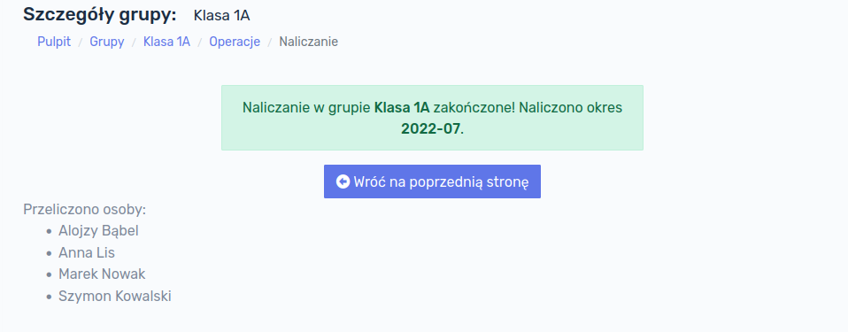

!> **UWAGA!** W przypadku gdy dokonamy naliczenia kolejny raz w danym miesiącu, system usunie poprzednie wartości naliczeń i naliczy je ponownie, zgodnie z przypisanymi abonamentami i ich wartościami. Przy poprawnej konfiguracji abonamentów, nie ma możliwości, aby opłata została naliczona powtórnie.

> **Przykład 1:** dokonano naliczeń dla całej grupy za miesiąc lipiec 2022. Następnie przypisano nowego ucznia do tej grupy. <u>System nie naliczy automatycznie nowemu uczniowi należności!</u> Należy ponownie dokonać naliczenia opłat dla grupy.
>
> **Przykład 2:** dokonano naliczeń dla całej grupy za miesiąc lipiec 2022. Następnie zorientowano się, że wartość abonamentu jest błędna. Należy skorygować wartość abonamentu i dokonać ponownego naliczenia opłat dla grupy. Wszystkie wpisy z błędną wysokością czesnego zostaną usunięte i zastąpione nowymi wartościami.

## Wyżywienie

Wyżywienie w programie może być naliczane na 3 sposoby:

- **miesięcznie** - stała kwota za dany miesiąc, która może być inna w każdym miesiącu
- **za dzień** - stała kwota za dzień, w którym uczeń zjadł posiłek
- **zależnie od wybranego posiłku** - przypadek, w którym opłata może być każdego dnia inna w zależności jakiego wyboru dokonał uczeń, np. jednego dnia zupa za 5 zł, drugiego zupa + II danie 15 zł, trzeciego dnia tylko II danie za 10zł.

### Miesięczne

Ustawienie wyżywienia naliczanego jeden raz w danym miesiącu jest bardzo podobne jak w przypadku standardowego abonamentu za czesne. Klikamy w menu głównym w przycisk `Abonamenty` → `Dodaj nowy abonament`i wypełniamy formularz, zaznaczając `Typ` jako `Wyżywienie`, a `Rodzaj płatności` jako `Miesięczna`:

Należy pamiętać, aby pole `Aktywny` było zaznaczone. Zatwierdzamy przyciskiem `Zapisz` i przechodzimy na listę abonamentów, gdzie powinien znajdować się już abonament z typem `Wyżywienie`:

W kolejnym kroku należy nadać wartość temu abonamentowi. Dokonujemy tego tak samo jak w przypadku czesnego. Klikamy kolejno `Sprawdź` → `Dodaj nową wartość`, następnie wpisujemy kwotę oraz datę rozpoczęcia okresu od którego abonament obowiązuje, np.:

Zatwierdzamy przyciskiem `Zapisz`. 

Ostatnią rzeczą jest przypisanie abonamentu uczniowi, analogicznie jak w przypadku czesnego, klikając kolejno: `Uczniowie` → `Abonamenty` (przy konkretnym uczniu) → `Dodaj nowy`. Następnie należy wybrać z listy rozwijanej abonament, który utworzyliśmy i uzupełnić datę, od której przypisujemy go uczniowi.

#### Naliczanie wyżywienia miesięcznego

Naliczenia wartości za wyżywienie miesięczne można dokonać:

- indywidualnie dla ucznia: `Uczniowie` → kliknąć na nazwisku ucznia → zakładka `Operacje` → przycisk `Należności` → przycisk `Przelicz wszystko`
- grupowo: `Grupy` → kliknąć na nazwie grupy → zakładka `Operacje` → przycisk `Nalicz`

### Za dzień

Wyżywienie może być także naliczane stałą kwotą za dzień.

> **Przykład:** chcemy naliczać opłatę za wyżywienie tylko za dni, w których uczeń przebywał w placówce.

Aby utworzyć tego typu abonament, klikamy w menu głównym w przycisk `Abonamenty` → `Dodaj nowy abonament`i wypełniamy formularz, zaznaczając `Typ` jako `Wyżywienie`, a `Rodzaj płatności` jako `Za obecność`:

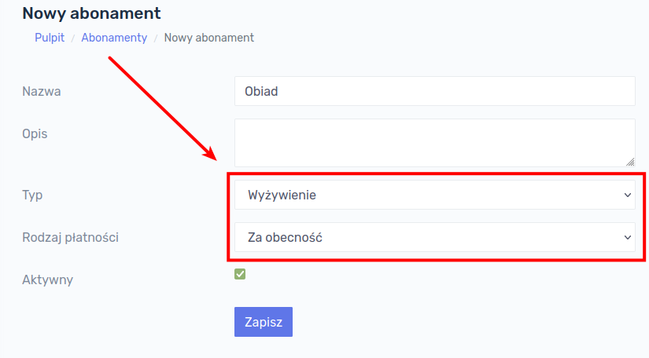

W kolejnym kroku należy nadać wartość temu abonamentowi. Dokonujemy tego tak samo jak w przypadku czesnego. Klikamy kolejno `Sprawdź` → `Dodaj nową wartość`, następnie wpisujemy kwotę oraz datę rozpoczęcia okresu od którego abonament obowiązuje, np.:

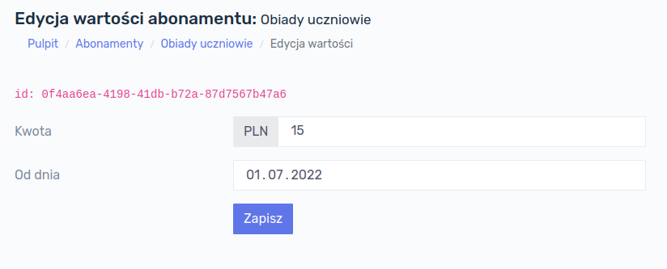

Zatwierdzamy przyciskiem `Zapisz`. 

!> UWAGA! Abonamentu **Wyżywienie** z rodzajem płatności **Za obecność** nie musimy przypisywać do ucznia! 

#### Przypisanie żywności za dzień

Aby naliczyć żywność za dzień, w którym uczeń był obecny, należy przejść do menu Grup i przy żądanej grupie kliknąć przycisk `Wyżywienie`:

Otworzy się okno z kalendarzem, w którym możemy przypisać posiłek w konkretnym dniu. Na liście znajdują się wszyscy uczniowie przypisani do grupy, którą wybraliśmy:

Należy przy danym uczniu i dacie wybrać z listy rozwijanej posiłek, który w rzeczywistości jest nazwą wcześniej utworzonego abonamentu. Po kliknięciu przycisku `Zapisz` dane zostają zapisane w bazie danych. Możemy przesuwać się w kalendarzu do przodu i do tyłu posługując się przyciskami `Wstecz` oraz `Dalej` lub opcjonalnie przejść do dowolnego okresu wybierając datę z kalendarza.

!> **UWAGA!** Aby opłaty za poszczególne posiłki zostały naliczone uczniom, należy je naliczyć indywidualnie konkretnym uczniom lub dokonać naliczenia dla całej grupy (patrz niżej).

#### Naliczanie wyżywienia za dzień

Naliczenia wartości za wyżywienie miesięczne można dokonać:

- indywidualnie dla ucznia: `Uczniowie` → kliknąć na nazwisku ucznia → zakładka `Operacje` → przycisk `Należności` → przycisk `Przelicz wszystko`

- grupowo: `Grupy` → kliknąć na nazwie grupy → zakładka `Operacje` → przycisk `Nalicz`

  

### Zależne od posiłku

Jeśli chcemy uzależnić wysokość opłaty od posiłku, można tego dokonać tworząc kilka abonamentów, np.:

- Zupa - w cenie 5 zł
- II danie w cenie 15 zł
- I i II danie w cenie 20 zł

Te abonamenty wraz z wartościami tworzymy analogicznie jak w przypadku naliczania żywności za dzień (patrz wyżej). 

#### Przypisanie żywności zależnej od posiłku

Aby przypisać dany posiłek konkretnemu uczniowi należy przejść do menu Grup i przy żądanej grupie kliknąć przycisk `Wyżywienie`:

Ostatnim krokiem jest wybranie odpowiednich opcji przy danym uczniu:

!> **UWAGA!** Należy pamiętać, że na powyższym ekranie następuje przypisanie uczniowi danego posiłku w konkretnych dniach. Naliczenia dokonujemy indywidualnie dla ucznia albo grupowo dla całej grupy (patrz niżej).

#### Naliczanie wyżywienia zależnego od posiłku

Naliczenia wartości za wyżywienie miesięczne można dokonać:

- indywidualnie dla ucznia: `Uczniowie` → kliknąć na nazwisku ucznia → zakładka `Operacje` → przycisk `Należności` → przycisk `Przelicz wszystko`
- grupowo: `Grupy` → kliknąć na nazwie grupy → zakładka `Operacje` → przycisk `Nalicz`

