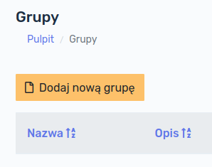
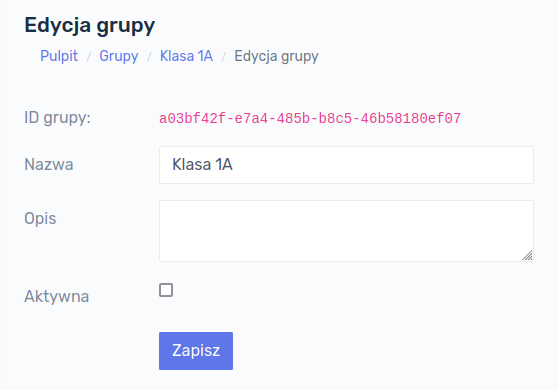
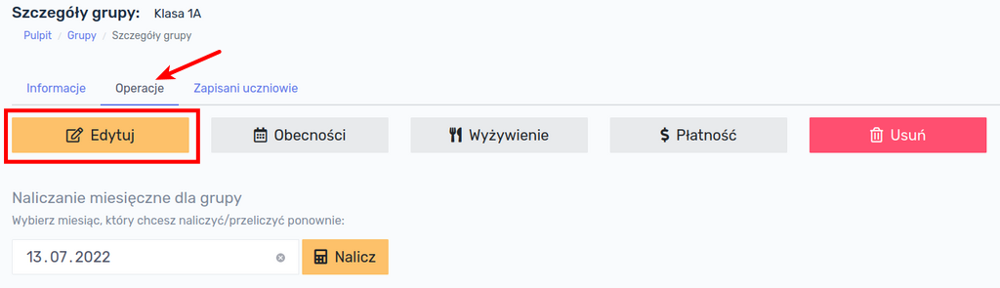
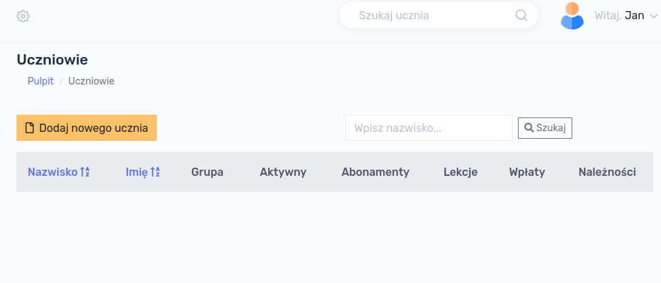
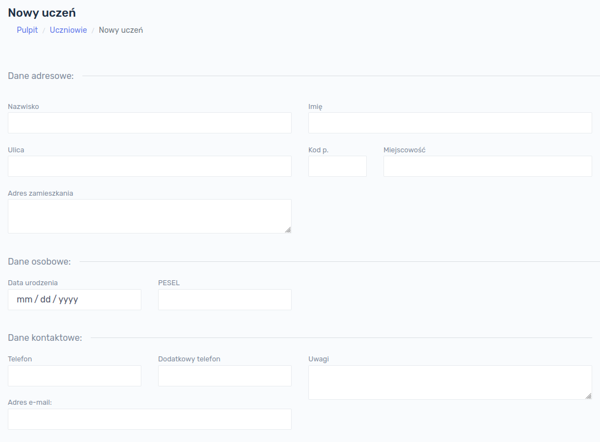
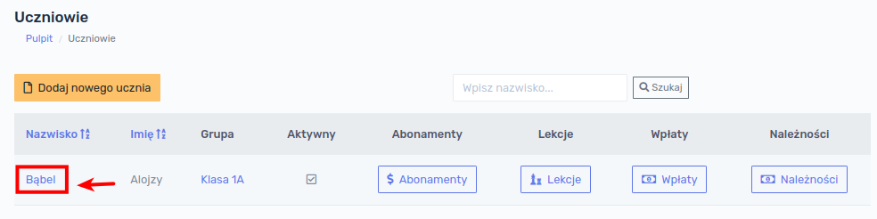
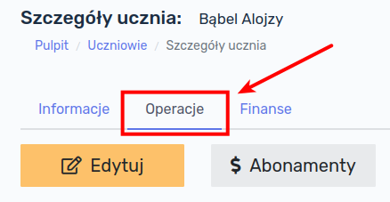

# Praca z programem

## Grupy

Pracę z programem można rozpocząć od stworzenia grup. Grupy służą uporządkowaniu uczniów i są w pewnym sensie odpowiednikiem klas w szkole. Aby wyświetlić listę grup należy w głównym menu po lewej stronie ekranu kliknąć przycisk  `Grupy`.

Po kliknięciu przycisku `Grupy` wyświetli się ekran z istniejącymi grupami.

!> W przypadku rozpoczęcia pracy z programem baza danych jest pusta i żadne grupy nie wyświetlają się na tym ekranie.

### Dodawanie grupy

W celu dodania nowej grupy należy kliknąć w przycisk `Dodaj nową grupę`:

Formularz, który się wyświetli zawiera następujące pola:

- **Nazwa grupy** - pole **<u>wymagane</u>**
- **Opis grupy** - pole **<u>opcjonalne</u>**
- **Aktywna** - określa, czy grupa jest aktywna (opis poniżej), pole **<u>opcjonalne</u>**

> **Aktywność** grupy oznacza wyświetlanie się jej na listach w innych modułach programu. Do grupy która nie jest aktywna nie można przypisać ucznia.

Po wypełnieniu formularza, klikamy przycisk `Zapisz`, następuje zapisanie informacji o grupie do bazy danych. Po ponownym Kliknięciu w przycisk `Grupy` w głównym menu, nowo dodana grupa będzie widoczna:

### Szczegóły grupy

W celu wyświetlenia szczegółów grupy należy kliknąć w nazwę konkretnej grupy na liście grup.

Wyświetli nam się informacja o grupie, tj. jej nazwa, opis oraz status (aktywna czy nie). 

### Edycja grupy

W celu dokonania edycji danych grupy, np. zmiany jej nazwy, opisu lub statusu aktywności, należy przejść do zakładki `Operacje`, a następnie kliknąć przycisk `Edytuj`:

Otworzy nam się formularz edycji grupy, analogiczny jak w przypadku Dodawania grupy. Po wprowadzeniu ewentualnych zmian można je zapisać klikając przycisk `Zapisz`.

### Usuwanie grupy

W celu usunięcia grupy należy przejść do zakładki `Operacje`, a następnie kliknąć przycisk `Usuń`.

!> **UWAGA!!! Usunięcie grupy jest operacją nieodwracalną!** Grupy nie można usunąć jeśli są do niej przypisani uczniowie.

## Uczniowie

Kolejnym etapem pracy z programem jest dodanie uczniów. Aby wyświetlić listę grup należy w głównym menu po lewej stronie ekranu kliknąć przycisk  `Uczniowie`.

Po kliknięciu przycisku `Uczniowie` wyświetli się ekran z istniejącymi w bazie danych uczniami.

!> W przypadku rozpoczęcia pracy z programem baza danych jest pusta i nie wyświetli żadnego ucznia.

### Dodawanie ucznia

W celu dodania do bazy danych nowego ucznia należy kliknąć w przycisk `Dodaj nowego ucznia`:

Formularz, który się wyświetli zawiera poniższe pola.

Pola wymagane:

- **Nazwisko**
- **Imię** 

Pola opcjonalne:

- Ulica
- Kod pocztowy
- Miejscowość
- Adres zamieszkania
- Data urodzenia
- PESEL
- Telefon
- Dodatkowy telefon
- Uwagi
- Adres e-mail
- Grupa
- Checkbox *Aktywny*

> **Aktywność** ucznia oznacza, że uczeń będzie wyświetlał się jej różnych listach w innych modułach programu. Odznaczenie tego pola oznacza, że nie można mu przypisać np. żadnego abonamentu, zajęć dodatkowych itd.

> **Grupa** może być przypisana uczniowi lecz nie jest to konieczne. Dowolność tej opcji służy temu, aby można było wcześniej przygotować kartoteki uczniów np. przed rozpoczęciem zajęć lub roku szkolnego.

W celu dodania ucznia do bazy danych należy kliknąć przycisk `Zapisz`.

Po ponownym Kliknięciu przycisku `Uczniowie` w głównym menu, nowo dodany uczeń będzie widoczny na liście uczniów

### Szczegóły ucznia

W celu wyświetlenia szczegółów ucznia, należy kliknąć w jego nazwisko na liście uczniów.

Po kliknięciu w nazwisko wyświetli się ekran ze szczegółami ucznia:

### Edycja ucznia

W celu dokonania edycji danych ucznia, np. zmiany adresu, grupy lub statusu aktywności, należy wyświetlić szczegóły ucznia, a następnie przejść do zakładki `Operacje` oraz kliknąć przycisk `Edytuj`:

Otworzy nam się formularz edycji danych ucznia, analogiczny jak w przypadku dodawania nowego ucznia. Po wprowadzeniu ewentualnych zmian można je zapisać klikając przycisk `Zapisz`.

### Usuwanie ucznia

W celu usunięcia ucznia należy przejść do zakładki `Operacje`, a następnie kliknąć przycisk `Usuń`.

!> **UWAGA!!! Usunięcie ucznia jest operacją nieodwracalną!** Ucznia nie można usunąć jeśli dokonano jakiegokolwiek naliczenia (np. wcześniej naliczono jakiś abonament, wyżywienie lub zajęcia dodatkowe).

